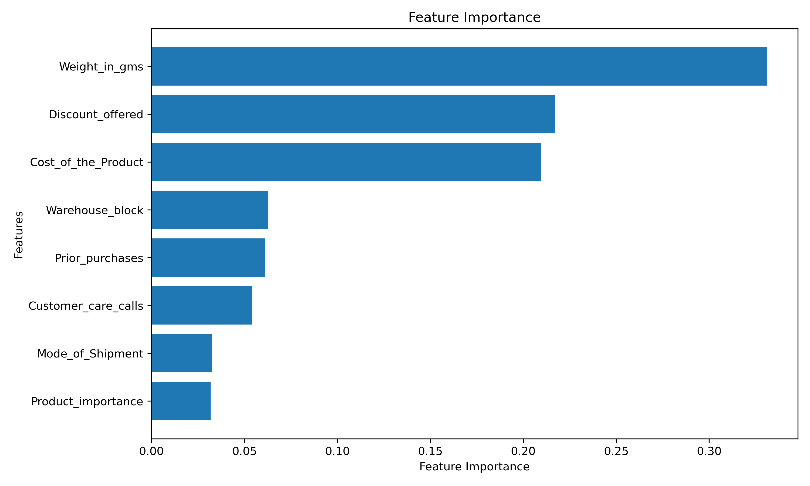

#  ShipSense - AI-Powered Shipping Delay Prediction

<p align="center">
  <b>Predict shipment delays before dispatch using Machine Learning.</b><br>
  An end-to-end ML project built with <b>Python, Scikit-learn, and Streamlit</b>.
</p>

---

## 📖 About the Project

Late deliveries impact customer satisfaction, increase operational costs, and reduce business efficiency. **ShipSense** is an AI-powered Shipping Delay Prediction System that analyzes shipment, customer, and product information to predict whether a shipment is likely to be delivered on time or delayed.

The project covers the complete Machine Learning workflow—from data preprocessing and exploratory data analysis to model training, evaluation, and deployment through an interactive Streamlit dashboard.

---

## ✨ Features

* 🤖 Real-time shipment delay prediction
* 📊 Interactive analytics dashboard
* 📈 Model performance visualization
* 🌲 Feature importance analysis
* 📉 Exploratory data analysis
* 🎨 Modern responsive Streamlit interface
* 📥 Download prediction results
* ⚡ Fast and easy-to-use web application

---

## 🖼️ Application Preview

### 🏠 Home


### 📊 Analytics Dashboard


### 🤖 Model Performance


---

## 🧠 Machine Learning Pipeline

* Data Cleaning
* Exploratory Data Analysis (EDA)
* Feature Engineering
* Label Encoding
* Feature Scaling
* Model Training
* Hyperparameter Tuning
* Model Evaluation
* Streamlit Deployment

---

## 🏆 Model Performance

| Metric       |      Score |
| ------------ | ---------: |
| **F1 Score** | **0.7157** |

**Why F1 Score?**

Shipping delay prediction is an imbalanced classification problem, making the F1 Score a better evaluation metric than accuracy because it balances both precision and recall.

---

## 🌲 Feature Importance

The trained model identifies the most influential features affecting shipment delays.



---

## 🛠️ Tech Stack

**Programming Language**

* Python

**Machine Learning**

* Scikit-learn
* Pandas
* NumPy

**Visualization**

* Matplotlib
* Plotly

**Deployment**

* Streamlit

---

## 📂 Project Structure

```text
.
├── app.py
├── styles.py
├── utils.py
├── requirements.txt
├── README.md
├── data/
├── models/
├── graphs/
├── notebook/
└── preview/
```

---

## 🚀 Installation

Clone the repository

```bash
git clone https://github.com/Harsh-Projects-Here/shipsense.git
```

Move into the project directory

```bash
cd shipsense
```

Install dependencies

```bash
pip install -r requirements.txt
```

Run the application

```bash
streamlit run app.py
```

---

## 🌐 Live Demo

**🚀 Streamlit App**

https://shipsense-dashboard.streamlit.app/

---

## 📁 Repository

https://github.com/Harsh-Projects-Here/shipsense

---

## 👨‍💻 Author

**Harsh**

Aspiring AI Engineer passionate about building practical Machine Learning applications and intelligent data-driven solutions.

---

## ⭐ Support

If you found this project useful, consider giving it a **⭐ Star** on GitHub.
